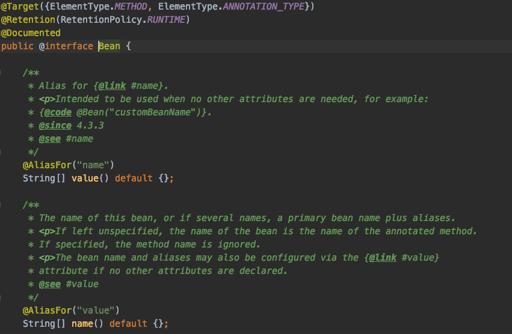
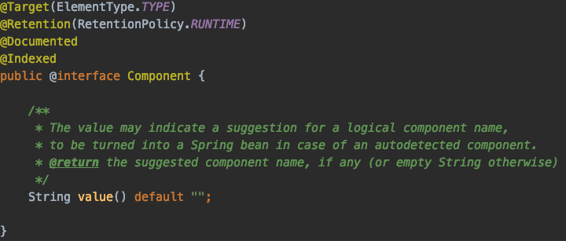

# @Bean VS @Component

@Bean 과 @Component 모두 스프링 컨테이너가 관리하는 Bean을 선언하는 어노테이션이다 그럼 차이는 뭘까?

- @Bean

  

  위의 코드를 보면 Bean은 메소드에 적용되는 어노테이션이다

  그리고 @Bean 어노테이션은 개발자가 컨트롤 할 수 없는 외부 라이브러리를 Bean으로 등록하고 싶은 경우 사용한다.

- @Component

  Component는 Class에 적용되는 어노테이션이다

  Class에 적용되는 어노테이션이라는 것의 의미는 개발자가 직접 만든 클래스를 Bean으로 등록하고 싶을때 사용한다는 것이다.

### 참고

- https://jojoldu.tistory.com/27

