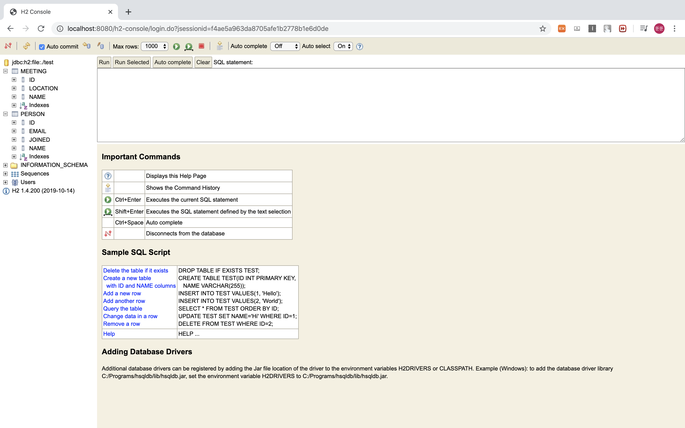

# Spring Boot DataBase

Spring Framework에는 SQL database를 사용하는 다양한 방법이 존재

1. `JdbcTemplate`을 이용한 방법
2. `Object Relational Mapping(ORM)`을 사용하는 방법

Spring Data는 추가적인 기능을 제공 ->  `Repository` 구현해주는 기능 제공

### DataSource 설정 방법

1. `spring.datasource.*` 을 이용하여 설정
   - `spring.datasource.url`
   - `spring.datasource.username`
   - `spring.datasource.password`
2. @ConfigurationProperties("app.datasource") 를 설정한 Bean생성
   - 비추천
     - 자동완성이 안됨
     - hikari가 설정돼있는 경우 url property값이 적용이 안됨 -> jdbc-url 로 가능

### Embedded Database Support

in-memory embedded database를 사용하게 되면 테스트할 때 유용하다

다만 영속성이 없기 때문에 지워지게 되며 설정을 미리 해놔야함

Auto Configuration 지원

- H2, HSQL, Derby 지원 
- URL들을 제공할 필요 없음 -> dependency만 추가

Embedded database Auto Configuration을 하기 위해서는 `spring-jdbc`가 추가되어야한다

- `spring-boot-starter-data-jpa` 에서 같이 들어오게 됨

  - Dependecy

    ```xml
    <dependency>
    	<groupId>org.springframework.boot</groupId>
    	<artifactId>spring-boot-starter-data-jpa</artifactId>
    </dependency>
    <dependency>
    	<groupId>org.hsqldb</groupId>
    	<artifactId>hsqldb</artifactId>
    	<scope>runtime</scope>
    </dependency>
    ```

  - SimpleCode

    ```java
    @Bean
    	public ApplicationRunner runner(final JdbcTemplate jdbcTemplate) {
    		return new ApplicationRunner() {
    			@Override
    			public void run(ApplicationArguments args) throws Exception {
    				Integer cnt =
    						jdbcTemplate.queryForObject("SELECT COUNT(*) FROM Customers", Integer.class);
    				System.out.println(cnt);
    			}
    		};
    	}
    ```

  - Query

    ```sql
    --schema
    DROP TABLE Customers IF EXISTS;
    
    CREATE table Customers (
        ID INTEGER IDENTITY PRIMARY KEY ,
        CustomerName varchar(255),
        Address varchar(255),
        City varchar(255),
        PostalCode varchar(255)
    );
    
    -- data
    Insert into Customers (CustomerName, Address, City, PostalCode) VALUES ('cardinal', 'skagen 21', 'stavanger', '4006');
    Insert into Customers (CustomerName, Address, City, PostalCode) VALUES ('minsoonss', 'sillim', 'seoul', '1234');
    
    ```

## Production Database

Datasource 선호

1. Spring boot 는 HikariCP를 선호 - 성능과 동시성(Concurrency)이 좋음
2. Tomcat DBCP
3.  위의 두개가 없으면 Commons DBCP2 사용

## JPA and "Spring Data"

`Java Persistenfce API(JPA)` 는 객체를 RDB와 매핑 

`spring-boot-starter-data-jpa`  POM을 추가하면 빨리 사용가능

추가되는 의존성

	1. Hibernate - JPA 구현체중 가장 인기있는 구현체
 	2. Spring Data JPA - JPA repository들을 쉽게 구현할 수 있도록 해준다

3. Spring ORMs - Spring framework의 core ORM 제공

### Entity Classes

Spring Boot는 "Entity Scanning"이 자동으로 Entity 인식

1. @Entity

     		2. @Embeddable
     		3. @MappedSuperclass

```properties
spring:
  jpa:
    hibernate:
      ddl-auto: create-drop
  datasource:
    url: jdbc:h2:file:./test
    username: sa
```

```java
@Entity
public class Person {

    @Id @GeneratedValue
    private Long id;

    private String name;

    private String email;

    @Temporal(TemporalType.TIMESTAMP)
    private Date joined;
}
```

```java
@Entity
public class Meeting {

    @Id @GeneratedValue
    private Long id;

    private String name;

    private String location;
}
```



### SpringData JPA

Spring Data JPA 는 메소드의 이름으로 쿼리를 자동 생성해준다

예를 들어 `CityRespository`라는 인터페이스에 `findAllByState(String state)` 를 선언하면 모든 도시를 찾는 쿼리를 만들어준다. 그리고 보다 복잡한 쿼리는 `Query` 어노테이션을 이용하면 된다.

```java
public interface CityRepository extends JpaRepository<City, Long> {
  
  page<City> findAll(Pageable pageable);
  
  City findByNameAndCountryAllIgnoringCase(String name, String country);
}
```

#### JPA Database를 자동으로 생성하고 지우기

```java
spring.jpa.hibernate.ddl.auto=create-drop
```

#### jooQ

Type safe 하게 쿼리를 만들어준다

다만 유료 DB를 쓰는경우 유료다 ex) 오라클

