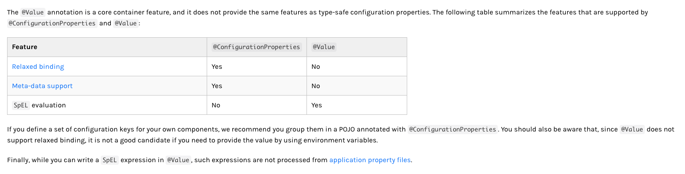
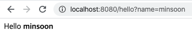

# Spring Boot Reference

- spring-boot 의 dependency 버전은 건들지마라! - spring 권장사항

- default package(package가 없는 상태 - 클래스를 만들었을때 패키지 정의가 안됨)를 사용하지마라

  - jar안에 있는 모든 클래스까지 다 스캔하기때문 - 성능문제 발생
  - 도메인 네임과 연관된 방식으로 패키지를 구성 후 그 아래 코드 작성하기 ex)com.example.project

- Spring boot는 자바 기반의 설정파일을 선호한다

- 굳이 xml 설정을 써야겠다면 - @ImportResource 어노테이션을 사용(경로는 루트 기준으로 찾음)

- AutoConfiguration을 쓰고 싶다면? - @EnableAutoConfiguration OR @SpringBootApplication

- 특정 AutoConfiguration을 쓰고싶지 않다면? - @EnableAutoConfiguration(exclude = {className})

  - application.yml 에서 spring.autoconfiguration.exclude에서 가능

- @SpringBootApplication = @EnableAutoConfiguration + @Configuration + @ComponentScan

- Maven에서 dependency추가할때 optional을 준다면? - gradle에는 optional을 지원하지 않는다.

  - 1번 프로젝트가 2번 프로젝트를 dependency로 추가한다면 2번 프로젝트 안에 있는 dependency를 추가하게 되는데 optional로 되어있는 dependency는 추가되지 않는다.

- logging level

  - TRACE, DEBUG, INFO, WARN, ERROR, FATAL, OFF

- ApplicationContext - Spring Boot 가 생기기전 아주 중요한 개념 -> BeanFactory

  - SpringApplication class의 Javadoc을 보면 제일 첫줄에 나옴
  - SpringApplication이 실행이 되면 제일먼저 ApplicationContext instance 를 만든다

- Reactive Web?? Servlet Web??

  - Reactive System??
    - 응답이 잘되고, 탄력적이며 유연하고 메세지 기반으로 동작하는 시스템
    - 유연하고 느슨한 결합을 가지고있으며 **확장성** 있다 -> 개발이 쉬워지며, 변경사항 적용이 쉽다.
    - **비동기메세징에 의존**
  - Reactive Programming
    - 비동기 데이터 스트림으로 프로그래밍하는 방식

- Listener는 Bean으로 구현을 못하지만 Runner는 Bean으로 구현

  - Listener는 ApplicationContext가 만들어지기전에도 끼어들 수 있다

- @ConfigurationProperties("minsoonss") - properties 혹은 yml에서 minsoonss로 되어있는 값을 가져와서 매핑해준다.

  ```java
  @Bean
  @ConfigurationProperties("minsoonss")
  @Validated
  public MinsoonssProperties minsoonssProperties() {
      return new MinsoonssProperties();
  }
  ```

- properties 혹은 yml 에서 값을 가져올때 @Validated를 사용하여 validation 체크를 할 수 있다.

  - @NotNull
  - @Valid
  - @NotEmpty
  - @Min
  - @Max ... 등

- @ConfigurationProperties VS @Value

  

- Logging
  - SpringBoot 는 Commons Logging을 사용하지만 logging으로 logback을 사용할 수 있도록 라우팅을 한다
  - spring.output.ansi.enabled=ALWAYS 하면 로깅 종류별로 색을 다르게 찍어준다
  - 실행시 debug=true로 찍을경우 특정 클래스에대해 debug로 찍어주는것이지 모든로그에 대해 debug로 찍어주는것은 아니다
  - logging.file.path, logging.file.name 을 이용하여 로그를 파일에 남길 수 있다
    - 둘 다 같이 쓰는 경우는 좀 더 구체적인 경로로 저장이 된다.(경로를 명시하는것보단 이름을 명시하는방향)
  - file은 10MB마다 lotate 된다
    - logging.file.max-size 로 파일 최대 크기를 지정할 수 있다
  - logging.file.max-history 로 해당날짜만큼 지나게되면 로그를 삭제해준다
  - logging.level.PACKAGE-NAME=debug 로 로깅레벨을 지정한다.
    - ex)logging.level.org.springframework.web=debug
  - **tip -> 로컬 개발시 hibernate schema generation 확인을 위해 hibernate는 trace로 걸어두기도 한다.**
  - logback-spring.xml 과 같은 파일로 logging 설정 가능
    - 확장 기능들을 설정가능
    - profile 별로 logging 설정 가능 
      - <springProfile name="dev"> 
      - <springProfile name="!dev">

### Developing Web Applications

#### 1. Spring Web MVC framework

- @Controller, @RestController @RequestMapping

- MVC 패턴에서 Controller에 어떠한 메소드로 매핑되었을때 해당 메소드에서 뷰의 이름으로 리턴이 된다. 그럼 해당 뷰를 보여주는 방식이 됨

  ```java
  /**
       * "main" -> ViewResolver* -> View*
       *  View 여러개 선택가능
       *  View* -> ContentNegotiatingResolver -> View
       * @return
       */
      @RequestMapping
      public String index() {
          return "main";
      }
  ```

- WebConfig 를 만들때 @EnableWebMvc 를 쓰면 안된다. - SpringBoot에서 제공하는 디폴트값이 적용이 안되기때문?

- HttpMessageConverter 종류

  WebMvcConfigurationSupport 에 등록된 default converter

  ```java
  class org.springframework.http.converter.ByteArrayHttpMessageConverter 
  class org.springframework.http.converter.StringHttpMessageConverter 
  class org.springframework.http.converter.StringHttpMessageConverter 
  class org.springframework.http.converter.ResourceHttpMessageConverter 
  class org.springframework.http.converter.ResourceRegionHttpMessageConverter 
  class org.springframework.http.converter.xml.SourceHttpMessageConverter 
  class org.springframework.http.converter.support.AllEncompassingFormHttpMessageConverter 
  class org.springframework.http.converter.json.MappingJackson2HttpMessageConverter 
  class org.springframework.http.converter.json.MappingJackson2HttpMessageConverter 
  class org.springframework.http.converter.xml.Jaxb2RootElementHttpMessageConverter 
  ```

  - 개발자가 HttpMessageConverter 를 빈으로 만들게 되면 HttpMessageConverters에 추가되게 된다.

    ```java
    @Configuration
    public class WebConfig implements WebMvcConfigurer {
    
        @Bean
        public HttpMessageConverters customConverters() {
            GsonHttpMessageConverter converter = new GsonHttpMessageConverter();
            return new HttpMessageConverters(converter);
        }
    }
    --------------------------------------------------------------------------
    class org.springframework.http.converter.json.GsonHttpMessageConverter 
    class org.springframework.http.converter.ByteArrayHttpMessageConverter 
    class org.springframework.http.converter.StringHttpMessageConverter 
    class org.springframework.http.converter.ResourceHttpMessageConverter 
    class org.springframework.http.converter.ResourceRegionHttpMessageConverter 
    class org.springframework.http.converter.xml.SourceHttpMessageConverter 
    class org.springframework.http.converter.support.AllEncompassingFormHttpMessageConverter 
    class org.springframework.http.converter.json.MappingJackson2HttpMessageConverter 
    class org.springframework.http.converter.xml.Jaxb2RootElementHttpMessageConverter 
    ```

    **Spring boot 의 AutoConfiguration는 ClassPath만 들어가있으면 관련 메세지 컨버터도 추가가 되어야한다. =>Gson의 경우도 dependency를 추가하면 자동으로 관리가 되어야한다.**

- Custom JacksonSerializers

  - @JsonComponent 를 이용하면 ObjectMapper에 들어간다
  - @JsonComponent 는 @Component 를 상속

- Webjars

  - 프론트엔드 라이브러리를 jar로 패키징

  - maven으로 프론트엔드 라이브러리를 추가할 수 있음

  - https://www.webjars.org/

  - ```html
    <!DOCTYPE html>
    <html lang="en">
    <head>
        <meta charset="UTF-8">
        <title>Title</title>
        <script src="/webjars/jquery/3.4.1/jquery.min.js"></script>
        <script type="text/javascript">
            $(document).ready(function () {
                console.log("ready");
            });
        </script>
    </head>
    <body>
    <h1>Hello Static</h1>
    </body>
    </html>
    ```

- ContentNegotiation

  - localhost:8080/user.json 과 같은 확장자를 넘기지마라
  - header에 type을 추가하는 방법
  - url에 format을 넘기는 방법
    - localhost:8080/user?format=json
  - spring.mvc.contentnegotiation.favor-?? 설정을 하면 원하는 방식의 콘텐츠를 협상할 수 있다.
    - favor를 넘기게 되면 accept header 는 무시된다.

- WebBindingInitializer

  - Spring MVC 에서 WebDataBinding을 할 때 사용

- Template

  - thymeleaf =>localhost:8080/hello?name=minsoon

    - 

    - ```java
      @Controller
      public class WebController {
          /**
           * String(Return value) ViewName -> ViewResolver -> View
           * @param model
           * @param name
           * @return
           */
          @GetMapping("/hello")
          public String hello(Model model, @RequestParam String name) {
              model.addAttribute("name", name);
              return "hello";
          }
      }
      ```

    - ```html
      <!DOCTYPE html>
      <html lang="en" xmlns:th="http://www.thymeleaf.org">
      <head>
          <meta charset="UTF-8">
          <title>Title</title>
      </head>
      <body>
      Hello <b th:text="${name}">...</b>
      </body>
      </html>
      ```

- CORS

  - Cross-origin resource sharing
  
  - @CrossOrigin
  
  - 요청의 근원지에 대한 접근 제어
  
  - Global CORS 설정을 하기위해서는 WebMvcCofigurer를 Bean으로 설정하면 된다
  
  - ```java
    @GetMapping("/bs")
    @CrossOrigin
    public Bangsong bangsong() {
    	Bangsong bangsong = new Bangsong();
      bangsong.setStreamer("minsoonss");
      bangsong.setTitle("spring web cors test");
      return bangsong;
    }
    ```
  
  - ```java
    @Configuration
    public class MyWebConfig implements WebMvcConfigurer {
    
        @Override
        public void addCorsMappings(CorsRegistry registry) {
            registry.addMapping("/bs").allowedOrigins("*");
        }
    }
    ```
  
- SpringBootTest

  - [SpringBootTest](/SpringBootTest.md)


