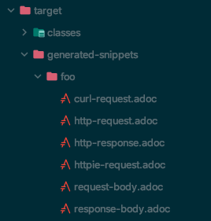

# SpringBootTest

Test module

1. Spring-boot-test
2. spring-boot-test-autoconfigure

Spring Boot 에서는 spring-boot-starter-test dependency를 추가

@SpringBootTest 라는 annotation을 제공

- MockTest

  Contoller

  ```java
  package com.minsoonss.springboot;
  
  import org.springframework.web.bind.annotation.GetMapping;
  import org.springframework.web.bind.annotation.RestController;
  
  /**
   * @author SoonMin Kwon. On 2020.02.21 10:25
   */
  @RestController
  public class SimpleController {
  
      @GetMapping("/")
      public String index() {
          return "Hello";
      }
  }
  ```

  TestCode

  ```java
  package com.minsoonss.springboot;
  
  import org.junit.Test;
  import org.junit.runner.RunWith;
  import org.springframework.beans.factory.annotation.Autowired;
  import org.springframework.boot.test.autoconfigure.web.servlet.AutoConfigureMockMvc;
  import org.springframework.boot.test.context.SpringBootTest;
  import org.springframework.test.context.junit4.SpringRunner;
  import org.springframework.test.web.servlet.MockMvc;
  
  import static org.assertj.core.api.Assertions.assertThat;
  import static org.springframework.test.web.servlet.request.MockMvcRequestBuilders.get;
  import static org.springframework.test.web.servlet.result.MockMvcResultHandlers.print;
  import static org.springframework.test.web.servlet.result.MockMvcResultMatchers.content;
  import static org.springframework.test.web.servlet.result.MockMvcResultMatchers.status;
  
  /**
   * @author SoonMin Kwon. On 2020.02.21 10:27
   */
  @SpringBootTest()
  @AutoConfigureMockMvc
  @RunWith(SpringRunner.class)
  public class SimpleControllerTest {
  
      @Autowired
      MockMvc mockMvc;
  
      @Test
      public void index() throws Exception{
          assertThat(mockMvc).isNotNull();
          mockMvc.perform(get("/"))
                  .andExpect(status().isOk())
                  .andExpect(content().string("Hello"))
                  .andDo(print());
      }
  }
  ```


 ### Test Configuration

1. 원하는 Bean을 nested class형태로 만들기 - **nested class 는 static으로 만들어야함**

   ```java
   /**
    * @author SoonMin Kwon. On 2020.02.21 10:27
    */
   @SpringBootTest
   @AutoConfigureMockMvc
   @RunWith(SpringRunner.class)
   public class SimpleControllerTest {
   
       @TestConfiguration
       static class TestConfig {
   
           @Bean
           public String myBean() {
               return "myBean";
           }
       }
   
       @Autowired
       MockMvc mockMvc;
   
       @Autowired
       String myBean;
   
       @Test
       public void index() throws Exception{
         	assertThat(myBean).isNotNull();
           assertThat(mockMvc).isNotNull();
           mockMvc.perform(get("/"))
                   .andExpect(status().isOk())
                   .andExpect(content().string("Hello"))
                   .andDo(print());
       }
   }
   ```

2. Test Configuration 제외시키기 - 따로 클래스로 빼게되면 해당 빈을 가져올 수 없다. -> 테스트클래스에서 @Import를 해야한다.

   ```java
   package com.minsoonss.springboot;
   
   import org.springframework.context.annotation.Bean;
   import org.springframework.boot.test.context.TestConfiguration;
   
   /**
    * @author SoonMin Kwon. On 2020.02.21 14:08
    */
   @TestConfiguration
   public class TestConfig {
       
       @Bean
       public String myBean() {
           return "myBean";
       }
   }
   
   ```

3. 실행하는 서버와 테스트하기

   `@SpringBootTest(webEnvironment=WebEnvironment.MOCK)` 를 사용하면 가짜 서블릿컨테이너가 뜨게됨

   `@SpringBootTest(webEnvironment=WebEnvironment.RANDOM_PORT)`  를 사용하면 진짜 서블릿컨테이너가 뜨게된다.

   `@WebMvcTest` 와 `@WebFluxTest` 는 단 하나의 컨트롤러를 테스트하기 위한 annotation

   ```java
   @SpringBootTest(webEnvironment = SpringBootTest.WebEnvironment.RANDOM_PORT)
   @AutoConfigureMockMvc
   @RunWith(SpringRunner.class)
   public class SimpleControllerTest {
       
       @Autowired
       TestRestTemplate testRestTemplate;
       
       @Test
       public void testWithRestTemplate() throws Exception{
           String body = this.testRestTemplate.getForObject("/", String.class);
           System.out.println(body);
           assertThat(body).isEqualTo("Hello");
       }
   }
   ```

4. @MockBean

   어떠한 빈에 영향을 주지않고 테스트 빈을 설정할 수 있다

   아래와 같이 SimpleController는 SimpleService를 가져다 사용하고 SimpleService의 getName()은 "Remote Service" 를 리턴하지만 Test에서 MockBean을 만들어 "Mock"을 리턴하도록 적용

   **DB data를 변환하지 않고 사용할때 주로 사용**

   ```java
   /**
    * @author SoonMin Kwon. On 2020.02.21 10:25
    */
   @RestController
   public class SimpleController {
   
       @Autowired
       SimpleService simpleService;
   
       @GetMapping("/")
       public String index() {
           return simpleService.getName();
       }
   }
   ```

   ```java
   /**
    * @author SoonMin Kwon. On 2020.02.21 14:37
    */
   @Service
   public class SimpleService {
   
       public String getName() {
           return "Remote Service";
       }
   }
   ```

   ```java
   /**
    * @author SoonMin Kwon. On 2020.02.21 10:27
    */
   @SpringBootTest(webEnvironment = SpringBootTest.WebEnvironment.RANDOM_PORT)
   @AutoConfigureMockMvc
   @RunWith(SpringRunner.class)
   public class SimpleControllerTest {
   
       @Autowired
       TestRestTemplate testRestTemplate;
   
       @MockBean
       SimpleService simpleService;
   
       @Test
       public void testWithRestTemplate() throws Exception{
           given(simpleService.getName()).willReturn("Mock");
   
           String body = this.testRestTemplate.getForObject("/", String.class);
           System.out.println(body);
           assertThat(body).isEqualTo("Mock");
       }
   }
   ```

5. @SpyBean

   원래있는 Bean을 그대로 사용하면서 일부만 변경 -> MockBean은 새로운 객체를 만들지만 SpyBean은 원래객체를 개조하는 것

6. Test AutoConfiguration

   - Bean이 필요할 경우

     ```java
     package com.minsoonss.springboot;
     
     import org.junit.Test;
     import org.junit.runner.RunWith;
     import org.springframework.beans.factory.annotation.Autowired;
     import org.springframework.boot.test.autoconfigure.json.JsonTest;
     import org.springframework.boot.test.json.JacksonTester;
     import org.springframework.boot.test.json.JsonContent;
     import org.springframework.test.context.junit4.SpringRunner;
     
     import static org.assertj.core.api.Assertions.assertThat;
     
     /**
      * @author SoonMin Kwon. On 2020.02.24 10:27
      */
     @RunWith(SpringRunner.class)
     @JsonTest
     public class SampleJsonTest {
     
         @Autowired
         JacksonTester<Sample> sampleJacksonTester;
         
         @Autowired
         JacksonTester<Person> personJacksonTester;
     
         @Test
         public void testJson() throws Exception{
             Sample sample = new Sample();
             sample.setName("minsoonss");
             sample.setNumber(29);
             JsonContent<Sample> jsonContent = sampleJacksonTester.write(sample);
             assertThat(jsonContent)
                     .hasJsonPathStringValue("@.name")
                     .extractingJsonPathStringValue("@.name").isEqualTo("minsoonss");
     
             assertThat(jsonContent)
                     .hasJsonPathNumberValue("@.number")
                     .extractingJsonPathNumberValue("@.number").isEqualTo(29);
         }
     }
     ```

   - Bean이 필요없을 경우

     ```java
     package com.minsoonss.springboot;
     
     import com.fasterxml.jackson.databind.ObjectMapper;
     import org.junit.Before;
     import org.junit.Test;
     import org.junit.runner.RunWith;
     import org.springframework.beans.factory.annotation.Autowired;
     import org.springframework.boot.test.autoconfigure.json.JsonTest;
     import org.springframework.boot.test.json.JacksonTester;
     import org.springframework.boot.test.json.JsonContent;
     import org.springframework.test.context.junit4.SpringRunner;
     
     import static org.assertj.core.api.Assertions.assertThat;
     
     /**
      * @author SoonMin Kwon. On 2020.02.24 10:27
      */
     public class SampleJsonTestTwo {
     
         JacksonTester<Sample> sampleJacksonTester;
     
         @Before
         public void setUp() {
             JacksonTester.initFields(this, new ObjectMapper());
         }
     
         @Test
         public void testJson() throws Exception{
             Sample sample = new Sample();
             sample.setName("minsoonss");
             sample.setNumber(29);
             JsonContent<Sample> jsonContent = sampleJacksonTester.write(sample);
             assertThat(jsonContent)
                     .hasJsonPathStringValue("@.name")
                     .extractingJsonPathStringValue("@.name").isEqualTo("minsoonss");
     
             assertThat(jsonContent)
                     .hasJsonPathNumberValue("@.number")
                     .extractingJsonPathNumberValue("@.number").isEqualTo(29);
         }
     }
     ```

7. AutoConfiguration Web Mvc

   @WebMvcTest 를 이용하면 모든 Controller가 Bean으로 등록

   ```java
   package com.minsoonss.springboot;
   
   import org.junit.Test;
   import org.junit.runner.RunWith;
   import org.springframework.beans.factory.annotation.Autowired;
   import org.springframework.boot.test.autoconfigure.web.servlet.WebMvcTest;
   import org.springframework.boot.test.mock.mockito.MockBean;
   import org.springframework.test.context.junit4.SpringRunner;
   import org.springframework.test.web.servlet.MockMvc;
   
   import static org.mockito.BDDMockito.given;
   import static org.springframework.test.web.servlet.request.MockMvcRequestBuilders.get;
   import static org.springframework.test.web.servlet.result.MockMvcResultMatchers.*;
   
   /**
    * @author SoonMin Kwon. On 2020.02.24 11:12
    */
   @RunWith(SpringRunner.class)
   @WebMvcTest
   public class SampleWebMvcTest {
   
       @Autowired
       private MockMvc mockMvc;
   
       @MockBean
       SimpleService simpleService;
   
       @Test
       public void testFoo() throws Exception{
           given(simpleService.getName()).willReturn("Minsoonss");
   
           mockMvc.perform(get("/"))
                   .andExpect(handler().handlerType(SimpleController.class))
                   .andExpect(status().isOk())
                   .andExpect(content().string("Minsoonss"));
       }
   }
   ```

8. Auto Configuration JPA Test

   @DataJpaTest

   TestEntityManager를 주입받을 수 있다. -> EntityManager의 subset이며 테스트에 용이한 메소드를 제공

9. Auto Configuration REST Clients

   @RestClientTest 를 이용하여 REST Clients 를 테스트 할 수 있다

   ```java
   /**
    * @author SoonMin Kwon. On 2020.02.24 14:48
    */
   @Service("sampleService")
   public class SampleServiceImpl implements SampleService {
   
       RestTemplate restTemplate;
   
       public SampleServiceImpl(RestTemplateBuilder builder) {
           this.restTemplate = builder.build();
       }
   
       public String getName() {
           return restTemplate.getForObject("/foo", String.class);
       }
   
       public int getNumber() {
           return 100;
       }
   }
   ```

   ```java
   /**
    * @author SoonMin Kwon. On 2020.02.24 14:51
    */
   @RunWith(SpringRunner.class)
   @RestClientTest(SampleService.class)
   public class SampleServiceTest {
   
       @Autowired
       SampleService sampleService;
   
       @Autowired
       MockRestServiceServer serviceServer;
   
       @Test
       public void fooTest() {
           serviceServer.expect(requestTo("/foo"))
                   .andRespond(withSuccess("minsoonss", MediaType.TEXT_PLAIN));
   
           String name = sampleService.getName();
           Assertions.assertThat(name).isEqualTo("minsoonss");
       }
   }
   ```

10. Auto Configuration SpringRest docs

    Rest call을 기반으로 docs을 만들어준다. Test code를 기반으로 만들어 줌

    ```xml
    <dependency>
    	<groupId>org.springframework.restdocs</groupId>
    	<artifactId>spring-restdocs-mockmvc</artifactId>
    </dependency>
    ```

    ```java
    @RunWith(SpringRunner.class)
    @WebMvcTest
    @AutoConfigureRestDocs
    public class SampleWebMvcTest {
    
        @Autowired
        MockMvc mockMvc;
    
        @MockBean
        SampleService sampleService;
    
        @Test
        public void testFoo() throws Exception{
            given(sampleService.getName()).willReturn("Minsoonss");
    
            mockMvc.perform(get("/foo"))
                    .andExpect(status().isOk())
                    .andExpect(content().string("Minsoonss"))
                    .andDo(document("foo"));//추가 돼야 할 부분
        }
    }
    ```

    - 결과

    

    - Configuration 추가하는 방법

      아래 방법 사용시 테스트의 메소드 이름으로  adoc이 생성된다

      ```java
      @TestConfiguration
      static class ResultHandlerConfiguration {
      
      	@Bean
      	public RestDocumentationResultHandler restDocumentationResultHandler() {
      		return MockMvcRestDocumentation.document("{method-name}");
      	}
      }
      ```

11. UserConfiguration and Slice

    1. UserConfiguration
       1. 메인클래스에 다른 어노테이션을 추가하여 메인클래스를 더럽히지 마라
       2. 다른 Configuration 클래스를 만들어서 @Configuration 어노테이션을 추가하라
       3. 필요시 @Import 어노테이션을 통해 읽어와라
    2. Slice
       1. @ComponentScan을 메인클래스에 명시하지마라
       2. @WebMvcTest 의 경우 웹 테스트를 위한 어노테이션이기 때문에 Controller 만 가져오도록 되어있다. 하지만 메인클래스에 명시할 경우 필요없는 클래스까지 스캐닝하게 된다